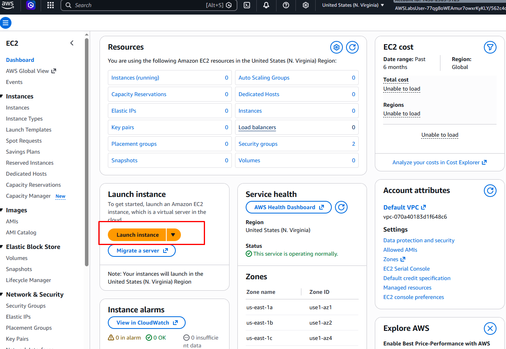
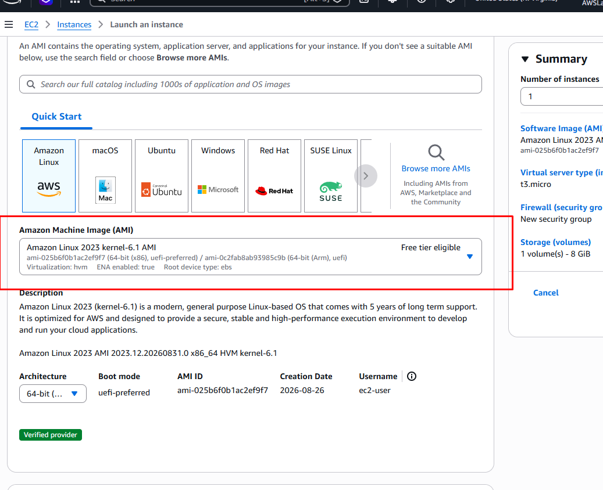
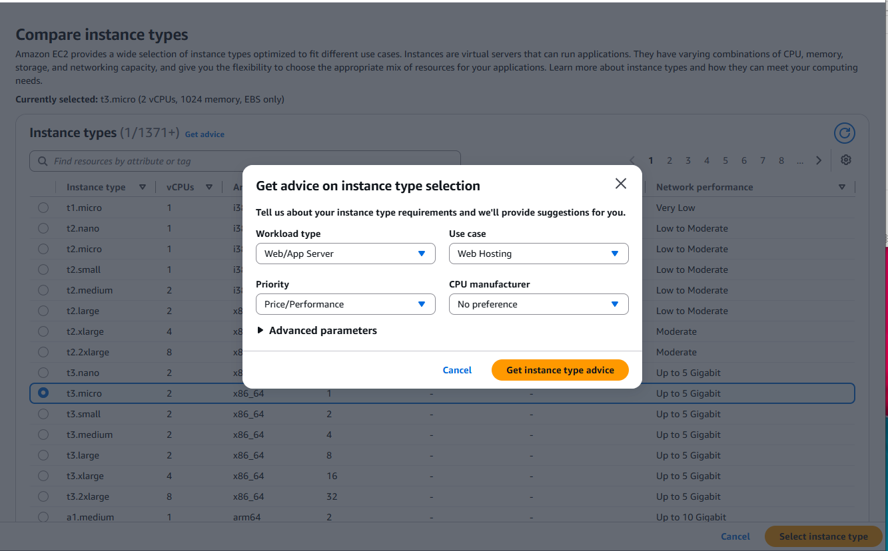
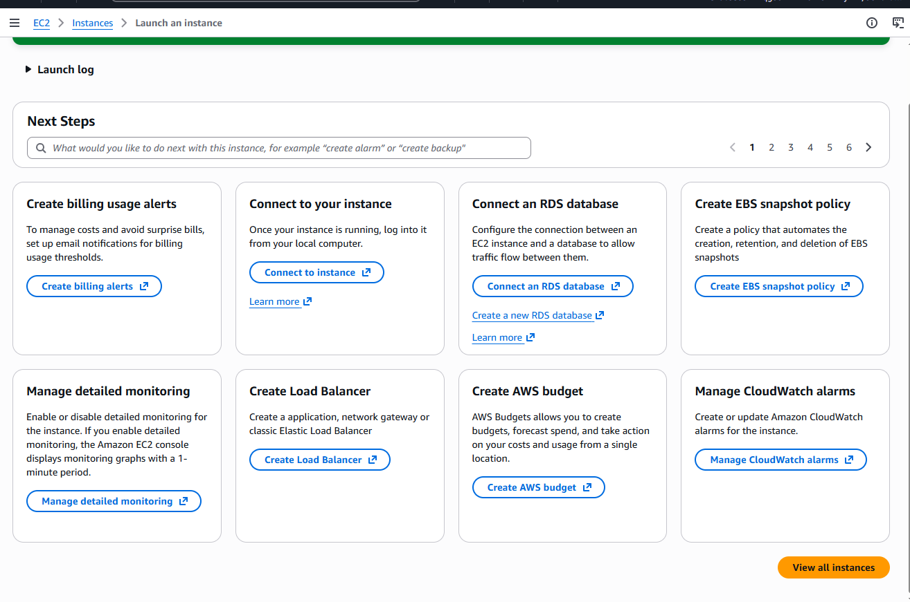
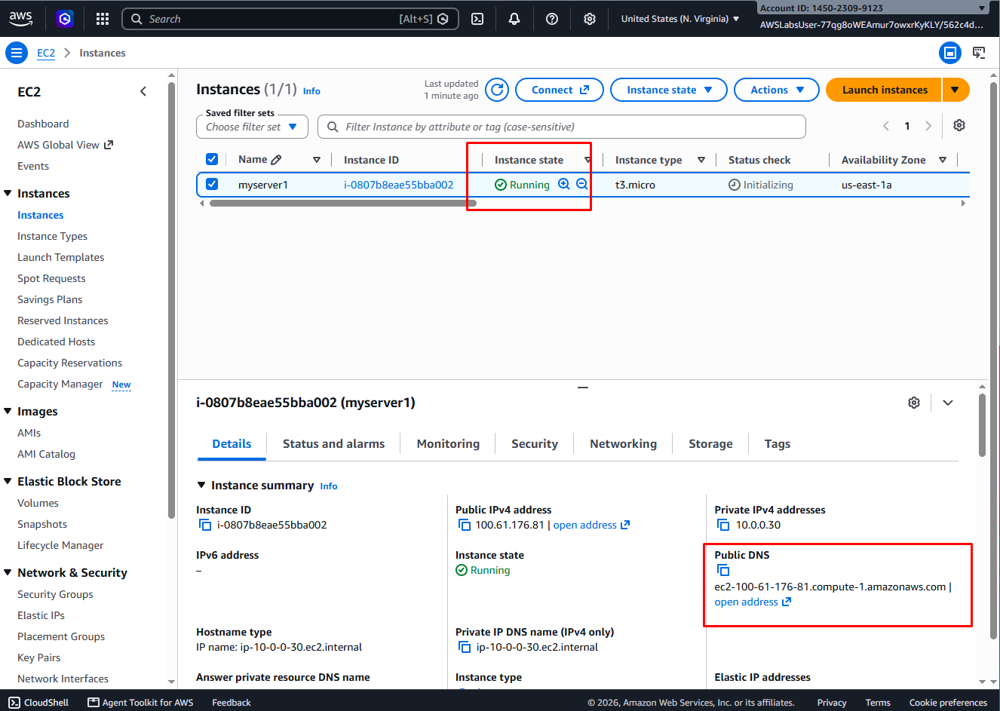
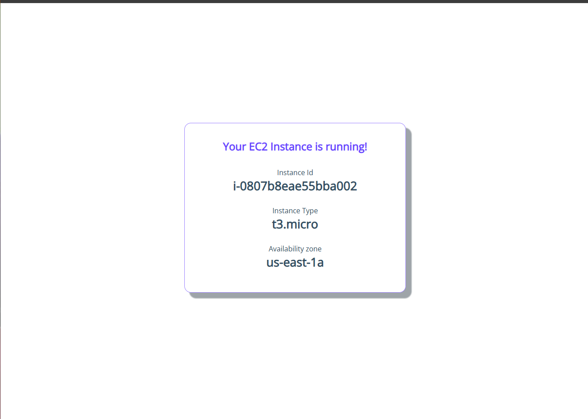
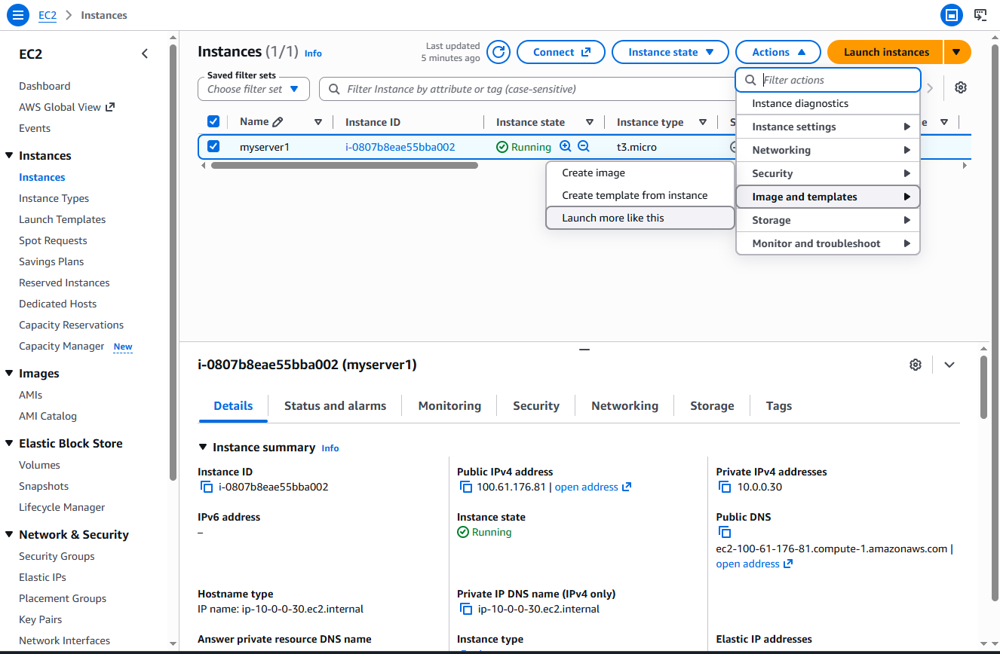
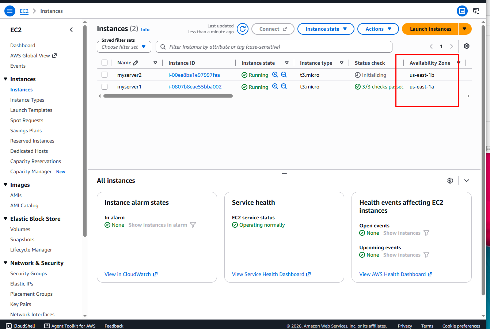

Scalable & Fault-Tolerant EC2 Web Server

📌 Project Overview
This project documents the deployment of a secure, highly available web server using Amazon Elastic Compute Cloud (EC2). The deployment covers initial instance provisioning, cost management considerations, integrated security services, and multi-Availability Zone (AZ) architecture for fault tolerance.

---

🛠️ Step-by-Step Implementation

* Regional Cost Awareness & AMI Selection
AWS infrastructure pricing varies significantly by region.

1. AWS Region & EC2 Instance Launch

Before deployment, I considered the selected AWS Region, as resource availability and pricing can vary by Region. I then accessed the Amazon EC2 console and initiated the instance launch process.

2. Operating System & Environment Selection

I selected an Amazon Machine Image (AMI) as the foundational template for the EC2 instance. The AMI provides the operating system and preconfigured software environment required for deployment.

3. Computing Architecture — Instance Type Selection

To align the virtual hardware configuration with the application workload, I evaluated available EC2 instance types using AWS advisory guidance to avoid unnecessary resource allocation.

4. Post-Launch Deployment Verification
The EC2 compute instance was successfully initialized and provisioned. To ensure production-grade reliability, the next phase focuses on infrastructure hardening and day-2 operations:

* Resource Governance:** Establishing baseline CloudWatch billing and resource metric monitors.
* High Availability Architecture:** Preparing the network interface to receive traffic from an Elastic Load Balancer (ELB).
* Data Resilience:** Implementing automated Amazon EBS snapshot policies for point-in-time disaster recovery.

5. EC2 Instance Deployment

The configuration was successfully completed and the EC2 instance was launched and transitioned to a running state.

6. Web Server Deployment

Configured the EC2 instance to host a web server and verified that the server was successfully running and accessible.

7. AMI-Based Instance Deployment

Used the existing AMI configuration to rapidly provision an additional EC2 instance, demonstrating how reusable machine images can streamline infrastructure deployment.

8. Availability Zone Distribution & Fault Tolerance

Deployed the additional EC2 instance in a separate Availability Zone to demonstrate workload distribution and improve infrastructure resilience against an Availability Zone-level failure.

 🏁 Project Summary & Technical Takeaways

This deployment successfully demonstrates the end-to-end provisioning, hardening, and scaling of a resilient web tier on AWS. By progressing from a single instance to a multi-Availability Zone architecture, the project models real-world enterprise infrastructure requirements.

Core Competencies Demonstrated
High Availability & Fault Tolerance: Eliminated single points of failure by distributing duplicate web server workloads across multiple Availability Zones using reusable AMIs for rapid horizontal scaling.
Cloud Cost Governance: Prioritized pragmatic resource allocation by evaluating regional pricing variances and rightsizing instance choices to prevent budget overruns.
Operational Readiness: Maintained production-grade standards by preparing paths for automated EBS snapshot policies, detailed CloudWatch monitoring, and Elastic Load Balancer (ELB) integration.
