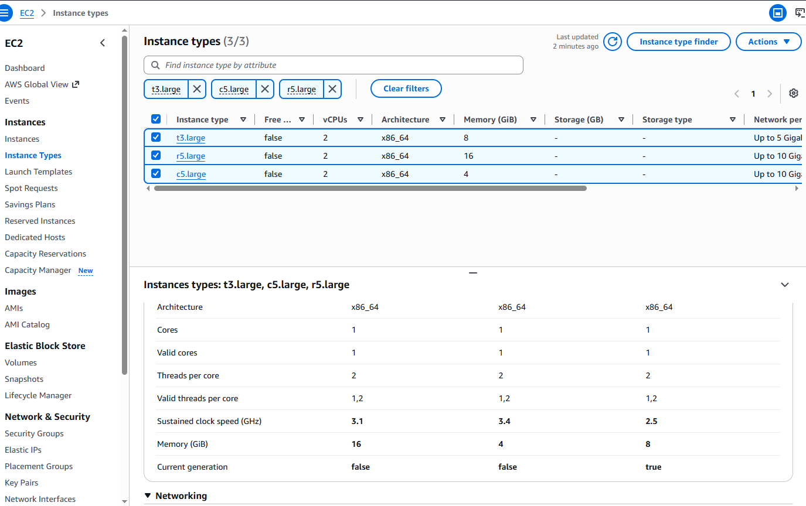
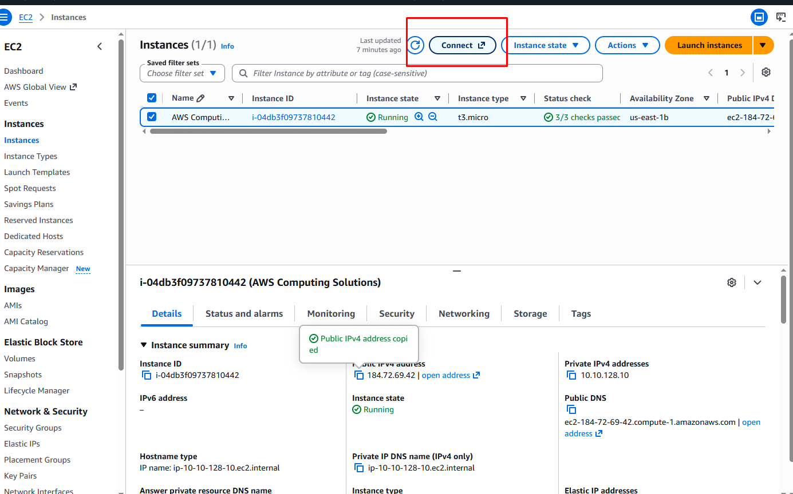
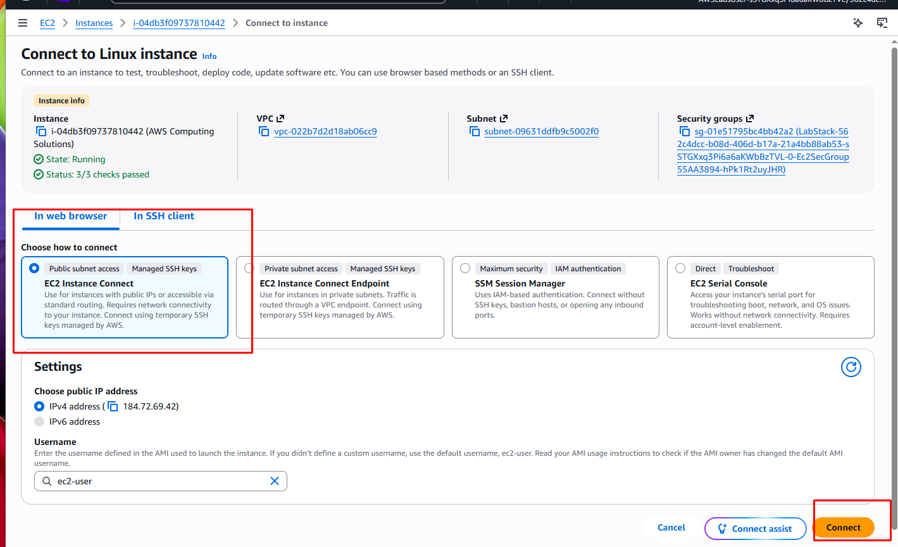
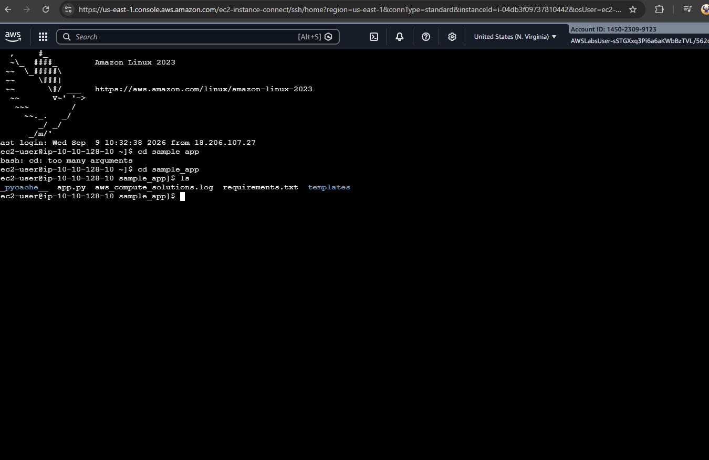
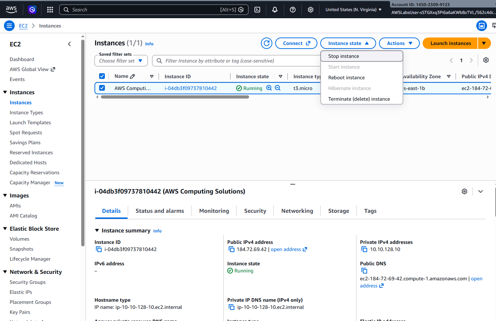
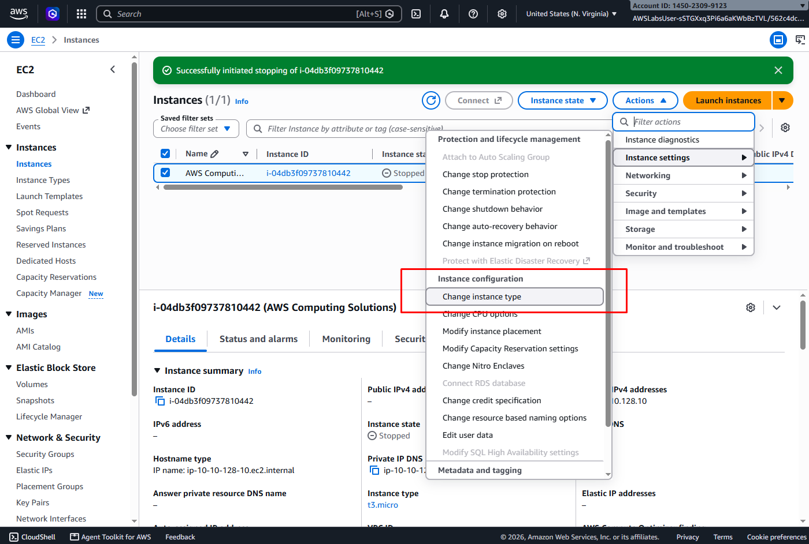
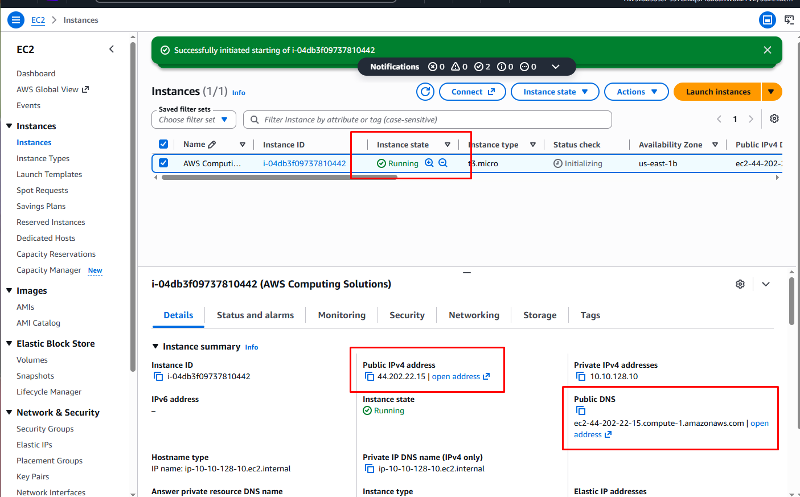

# Vertical EC2 Performance Tuning & Infrastructure Scaling

📌 Project Overview
This project documents the performance optimization of an Amazon Elastic Compute Cloud (EC2) instance through vertical scaling (scaling up). The deployment covers remote server management via Linux, performance evaluations, managed instance state transitions, and the physical modification of instance hardware classes to remediate system bottlenecks.

🛠️ Step-by-Step Implementation

* Resource Assessment & Workload Evaluation
Before altering running infrastructure, active computing requirements must be evaluated against available resource tiers.

1. Computing Architecture — Instance Type Comparison
To align virtual hardware configurations with growing application workloads, I evaluated available EC2 instance types to determine the optimal compute and memory tier for the task.

2. Establishing Remote Connectivity
Initiated the process to connect securely to the target web tier instance from the AWS infrastructure dashboard.

3. Browser-Based Terminal Initialization
Utilized AWS EC2 Instance Connect to establish a secure, browser-based terminal session with the server. This cloud-native access method streamlines administration by leveraging AWS IAM permissions for authentication, completely eliminating the need to manually manage or store local SSH key pairs.

4. Operating System Administration
Accessed the active Linux environment to audit running processes, analyze system resource baselines, and prepare files for the hardware upgrade.

5. Managed Instance State Transition (Shutdown)
To modify underlying virtual hardware properties, the compute resource must safely be brought offline. I executed a controlled stop command to preserve file system integrity and release host machine bindings.

6. Execution of Vertical Scaling Workflow
With the instance in a stopped state, I performed the physical hardware upgrade by modifying the instance configuration parameters to a higher-tier compute class.

7. Infrastructure Verification & Success Criteria
The upgraded instance was successfully re-initialized and transitioned back to a running state, verifying a completed vertical scaling lifecycle.

🏁 Project Summary & Technical Takeaways

This deployment successfully demonstrates the end-to-end execution of a vertical scaling workflow to remediate infrastructure bottlenecks on AWS. By managing instance states and upgrading compute classes, the project models real-world enterprise system maintenance and resource tuning.

🛠️ Core Competencies Demonstrated
* Compute Performance Tuning: Eliminated resource constraints by successfully transitioning an active workload to an optimized instance family with increased processing and memory profiles.
* Cloud-Native Systems Administration: Demonstrated competence in remote environment management by accessing and configuring running servers via AWS EC2 Instance Connect, showcasing a secure approach to server management without traditional key-pair exposure.
* Lifecycle Governance & Maintenance Planning: Managed structural compute upgrades within strict operational parameters, acknowledging and handling the necessary downtime constraints required to alter hardware states.
