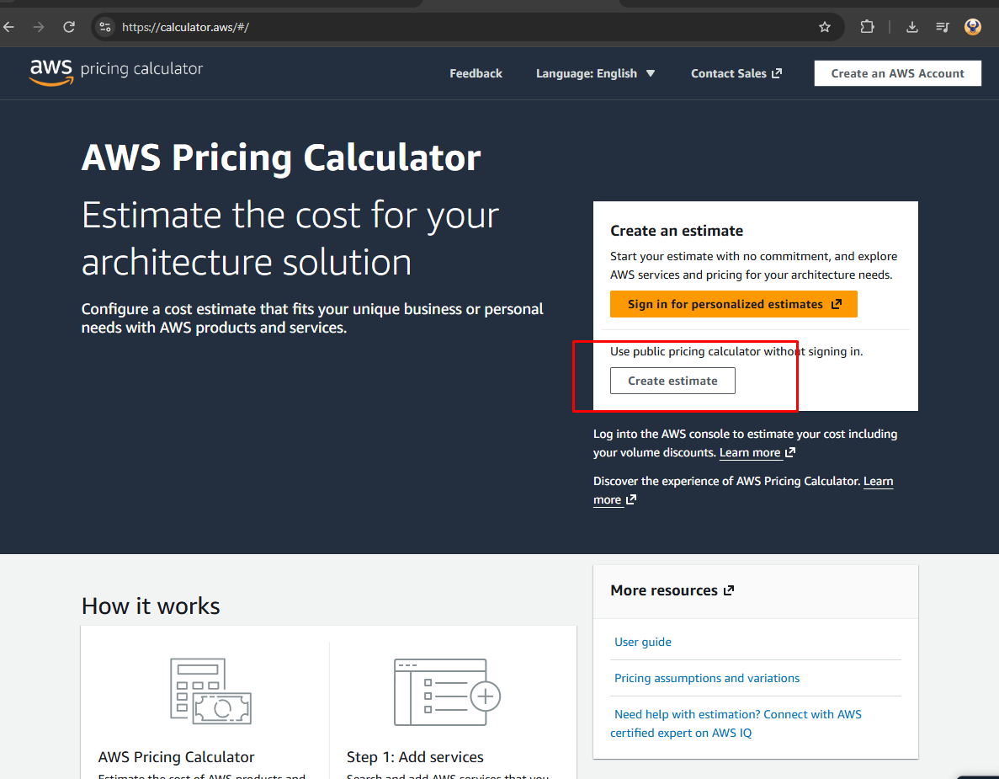
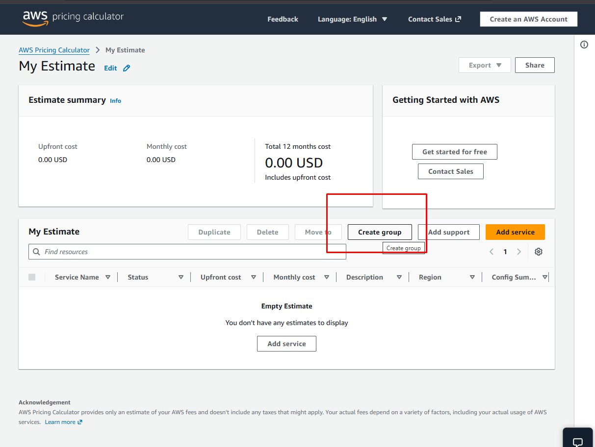
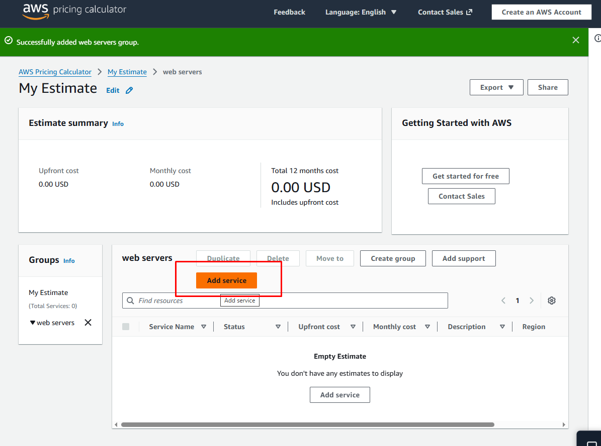
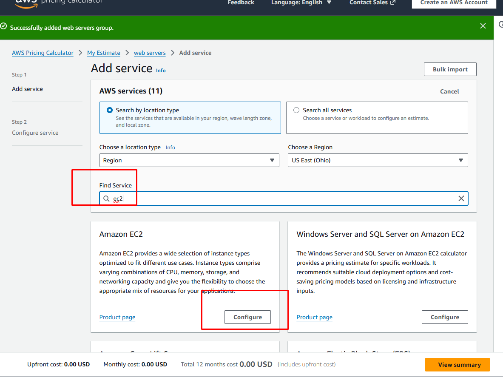
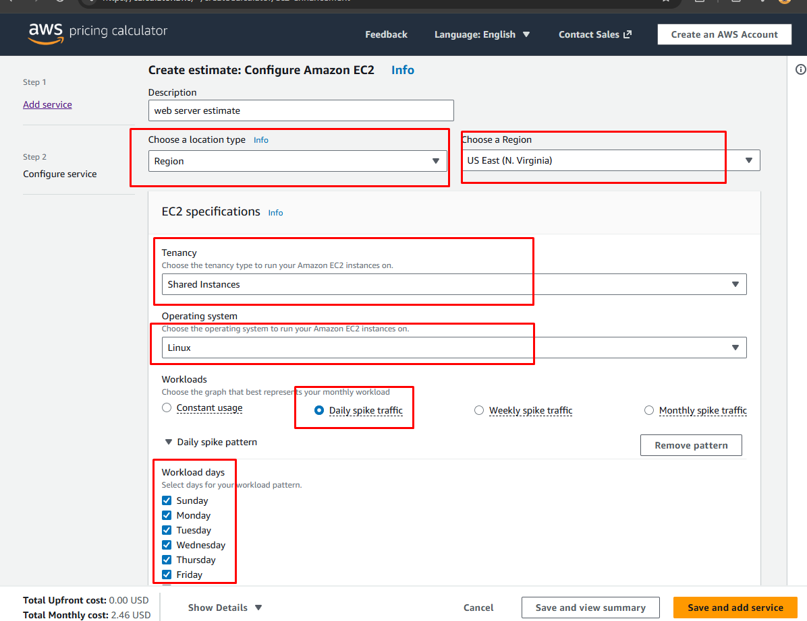
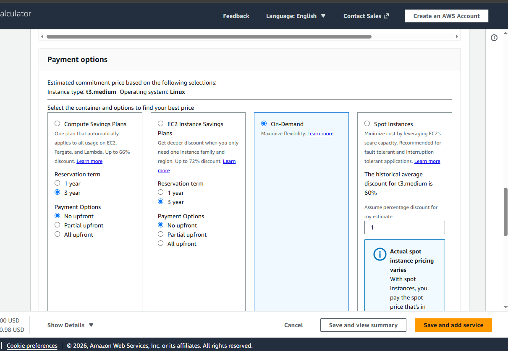
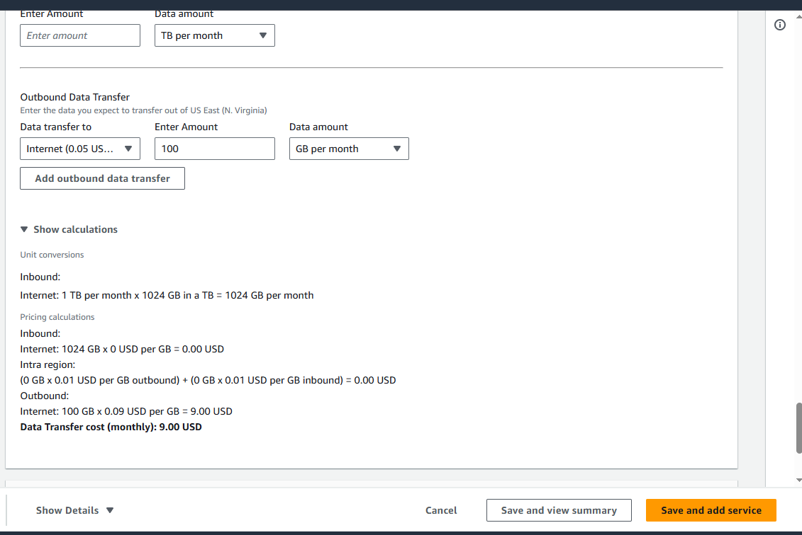
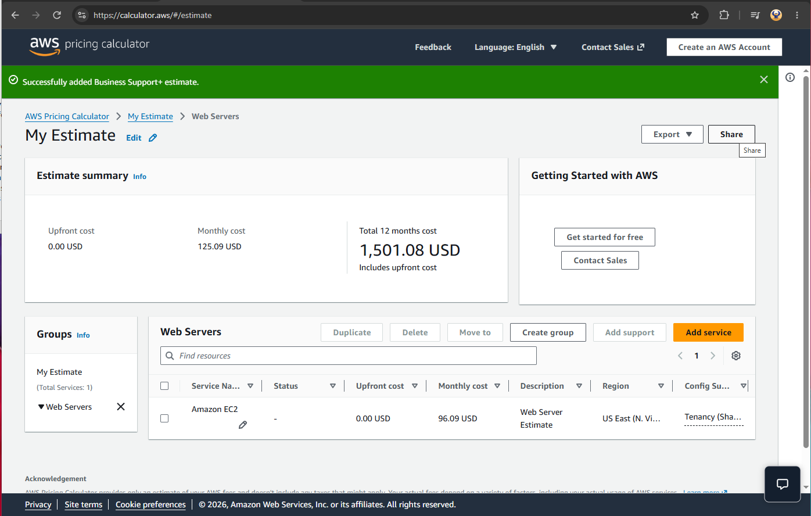

 Project 4 — AWS Pricing Calculator: Cost Estimation & Solution Modeling

📋 Project Overview

This project demonstrates the use of the AWS Pricing Calculator to model AWS workloads, evaluate service configurations, and estimate projected infrastructure costs before implementation.

The exercise covers service selection, EC2 configuration, purchasing options, data transfer considerations, and annual cost estimation, providing a structured approach to **cloud cost planning and financial analysis**.

---

# 🔧 Implementation

## 1. Accessing AWS Pricing Calculator

Accessed the **AWS Pricing Calculator** to begin modeling the infrastructure requirements and developing a projected AWS cost estimate.

---

## 2. Organizing the Cost Estimate

Created a dedicated estimate group to organize the AWS services and resources associated with the proposed workload.

---

## 3. Selecting AWS Services

Selected the required AWS service components to begin modeling the proposed cloud infrastructure and associated costs.

---

## 4. EC2 Workload Configuration

Selected **Amazon EC2** and configured the required compute specifications and service parameters to reflect the proposed workload.

---

## 5. Instance Configuration & Workload Parameters

Configured the EC2 tenancy, operating system, workload characteristics, and other instance parameters used by the calculator to determine the projected compute cost.

---

## 6. On-Demand Pricing Model

Evaluated the **On-Demand** purchasing option, which provides compute capacity without a long-term commitment and is suitable for workloads with variable or unpredictable usage requirements.

---

## 7. Data Transfer Cost Analysis

Reviewed the different data transfer categories used in AWS cost estimation:

- **Inbound Data Transfer:** Data entering AWS from the Internet, which is generally not charged.
- **Inter-Region / Intra-Region Transfer:** Evaluated potential charges associated with transferring data between applicable AWS resources and Availability Zones.
- **Outbound Data Transfer:** Considered costs associated with data leaving AWS to the Internet or other AWS Regions.

---

## 8. Projected Annual Cost

Reviewed the final projected annual AWS cost, including the configured infrastructure and applicable AWS Support plan.

---

# 🏁 Project Summary & Technical Takeaways

This project demonstrates the use of **AWS Pricing Calculator for cloud cost modeling and infrastructure planning**. By configuring workload requirements, purchasing options, data transfer considerations, and support costs, the exercise provides a structured approach to evaluating projected AWS expenditure before deployment.

## 🛠️ Core Competencies Demonstrated

- **Cloud Cost Modeling:** Created structured AWS cost estimates based on projected workload requirements.
- **EC2 Cost Analysis:** Evaluated compute configuration, tenancy, operating system, and purchasing options.
- **Pricing Strategy:** Compared cost implications of different AWS purchasing models.
- **Data Transfer Analysis:** Evaluated how network traffic patterns can affect cloud infrastructure costs.
- **Financial Planning:** Developed an annual infrastructure estimate incorporating AWS Support costs.
- **Cost-Aware Architecture:** Applied cost considerations when evaluating proposed AWS infrastructure.

