Project 5 — Amazon RDS: Relational Database Deployment, Security & High Availability

📋 Project Overview

This project demonstrates the deployment and configuration of a managed relational database using Amazon RDS, including database engine selection, compute and storage configuration, high availability, network security, and read replica deployment.

🔧 Implementation

1. Evaluating Database Hosting Options

Reviewed the option of hosting a SQL-based relational database directly on an **EC2 instance** using an appropriate AMI from the EC2 catalog. While this approach provides greater control, it also requires additional responsibility for database installation, configuration, maintenance, and administration.

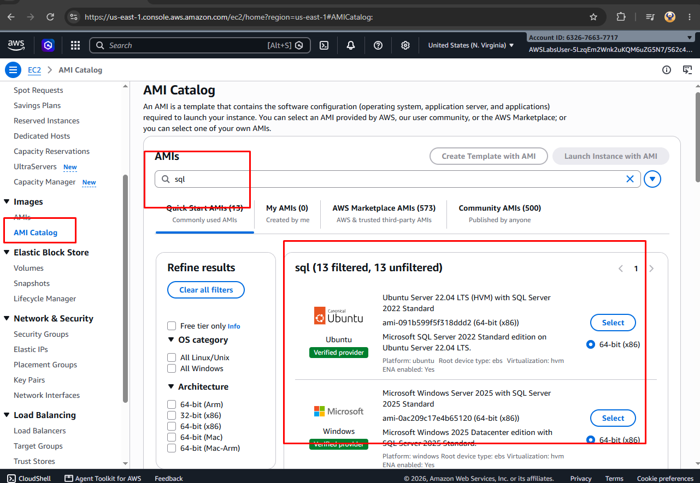

---

2. Selecting Amazon RDS

Selected **Amazon RDS** as the managed database solution to automate common operational tasks associated with relational database administration.

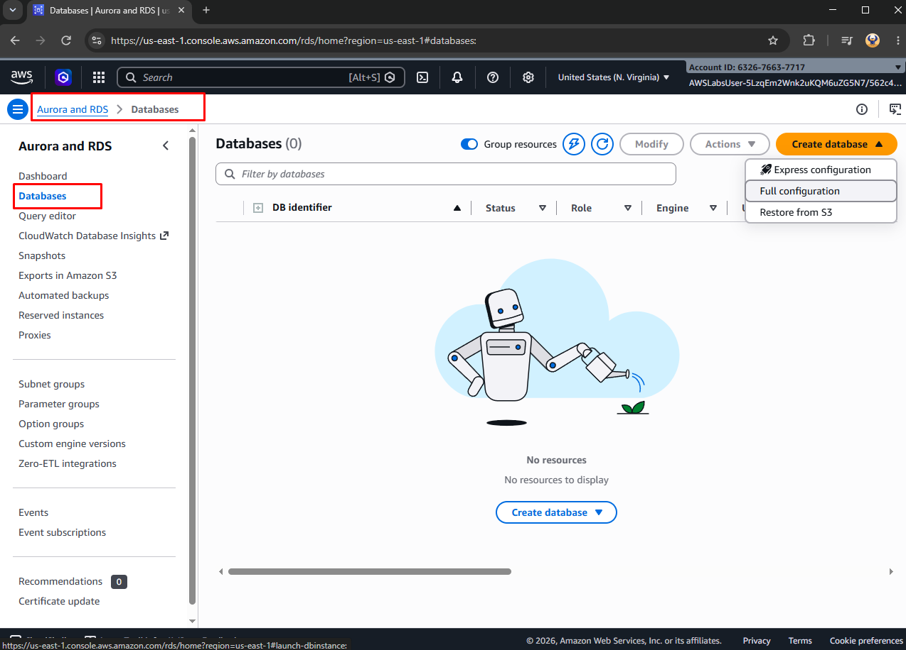

---

3. Selecting the Database Engine

Selected the required **relational database engine** for the RDS deployment based on the database requirements.

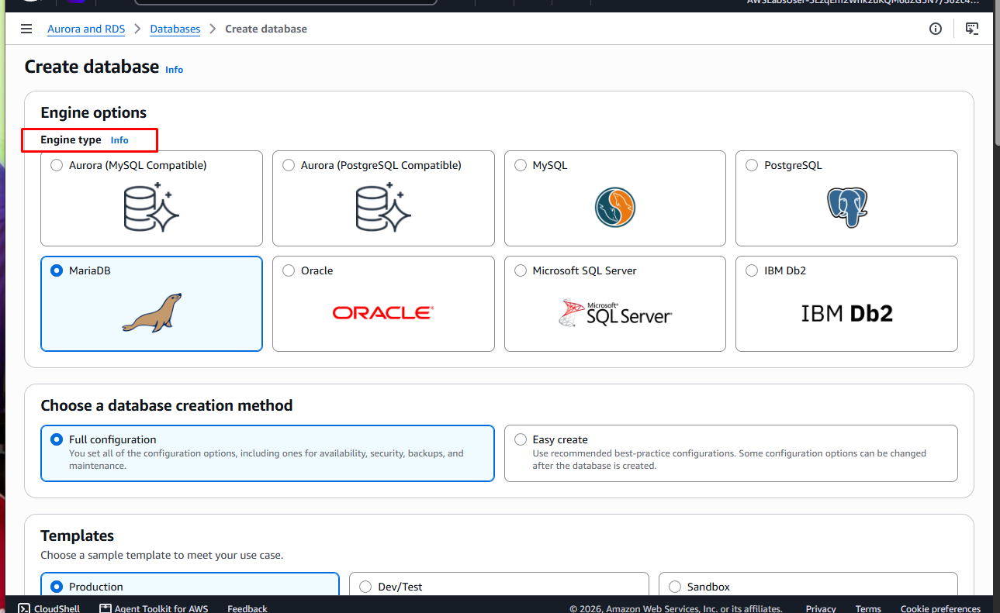

---

4. Configuring Instance Type & Storage

Configured the RDS **instance type and storage capacity** to provide the required database compute and storage resources.

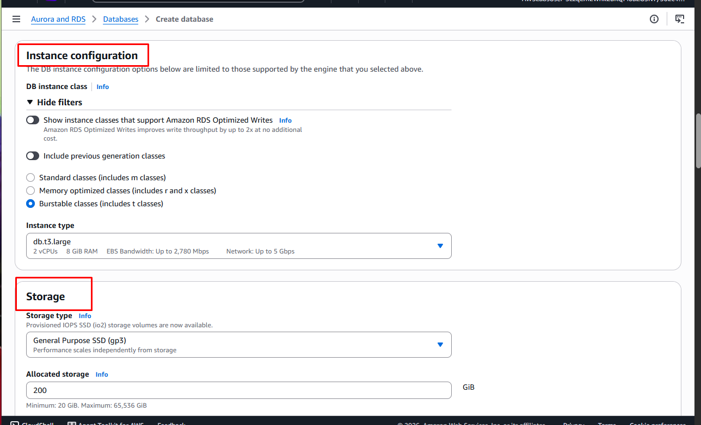

---

5. Storage Autoscaling & Multi-AZ Deployment

Enabled storage autoscaling to allow the database storage capacity to increase when additional capacity is required.

Configured a standby database instance in a separate Availability Zone to support high availability and improve resilience against an Availability Zone failure.

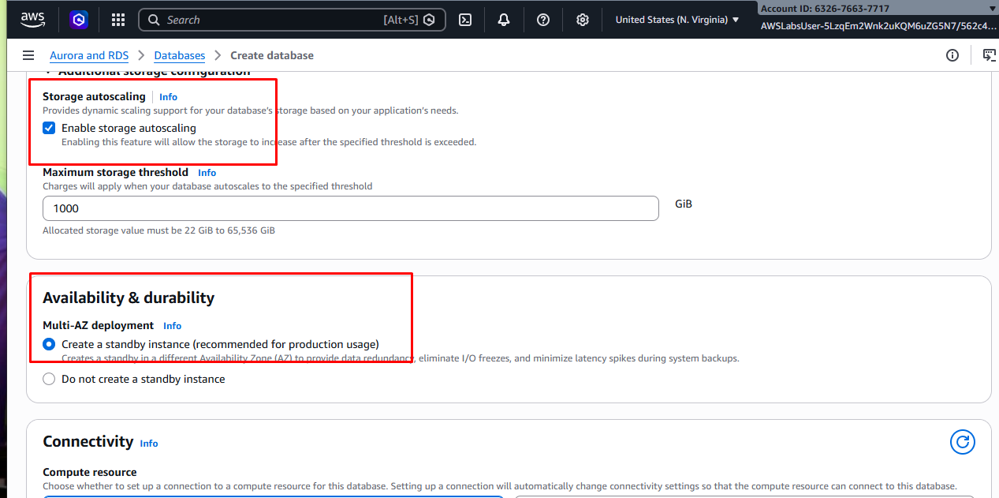

---

6. Private Database Network & Security Controls

Secured the database by placing it within a private DB subnet group and disabling public accessibility. Configured VPC security groups to enforce controlled network access to the database.

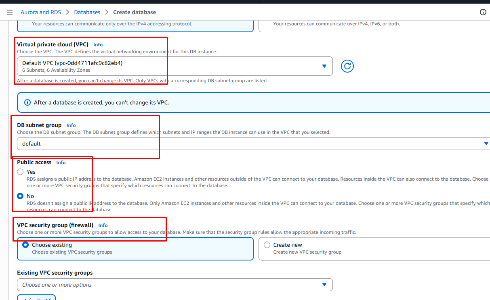

---

7. Creating the Initial Database

Configured the initial database name during the RDS deployment process, establishing the starting database environment for the workload.

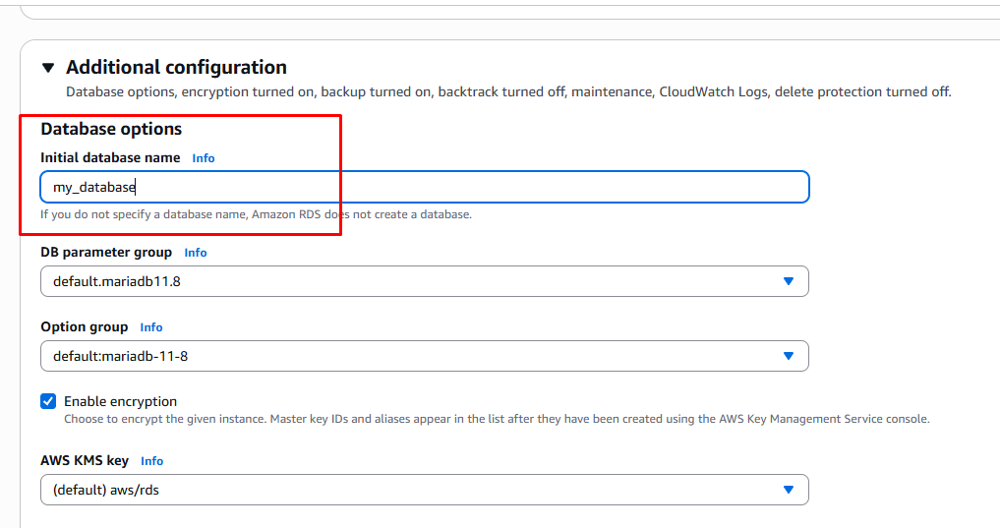

---

8. Verifying Database Availability

Confirmed that the Amazon RDS database instance was successfully deployed and reached an available/running state.

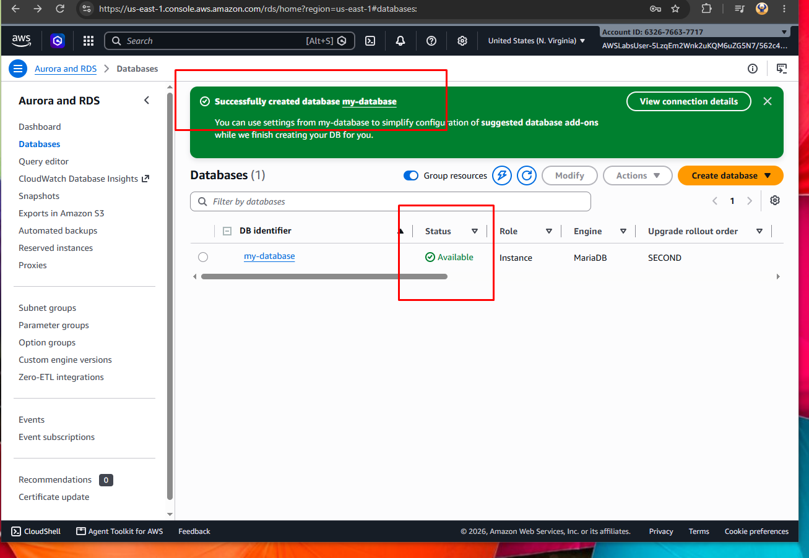

---

9. Deploying an RDS Read Replica

Created an Amazon RDS Read Replica to distribute read operations away from the primary database instance.

This architecture helps reduce the read workload on the primary database and provides additional capacity for applications with read-intensive workloads.

  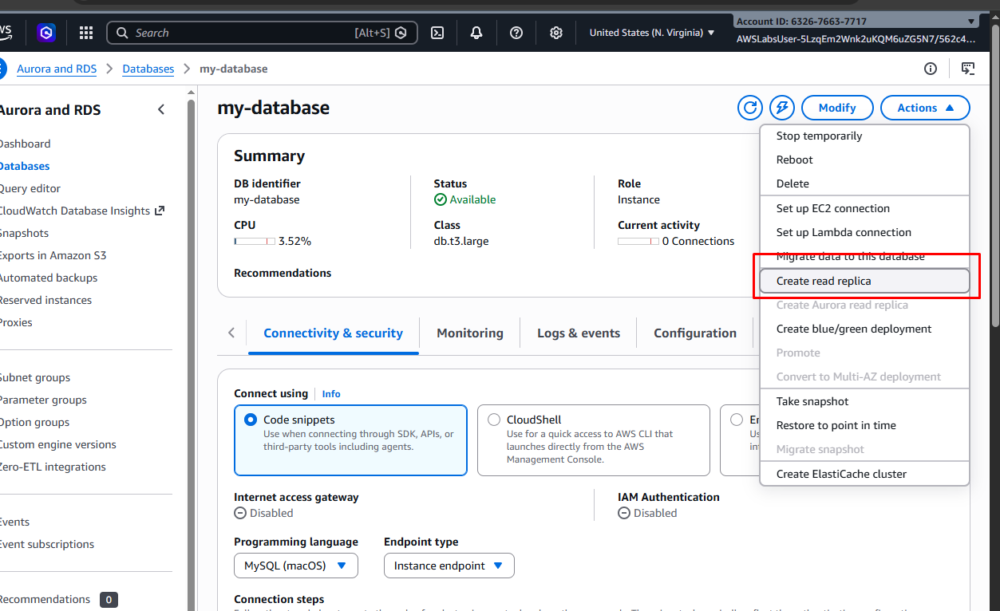
  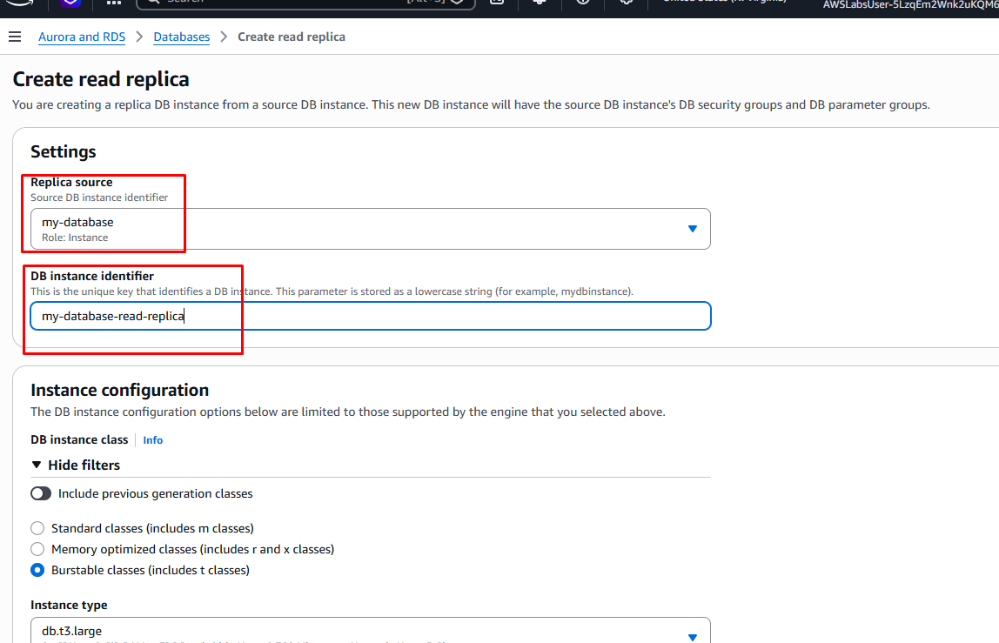
  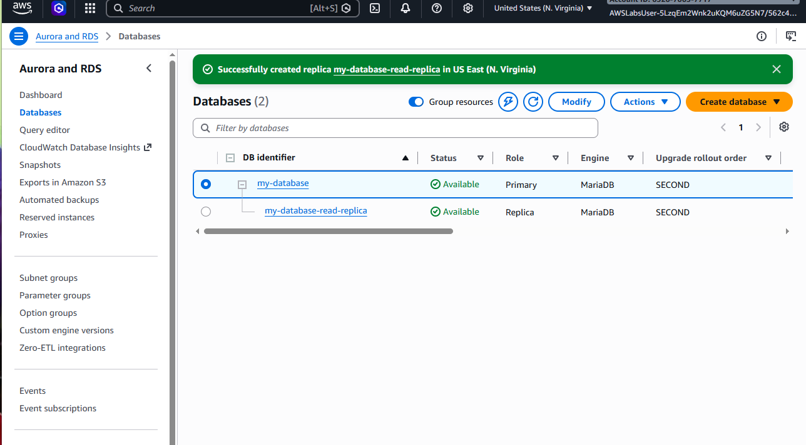

---

# 🏁 Project Summary & Technical Takeaways

This project demonstrates the deployment of a **managed relational database using Amazon RDS**, including database engine selection, compute and storage configuration, storage autoscaling, Multi-AZ high availability, private networking, security controls, and read-replica architecture.

The implementation demonstrates how AWS managed database services can reduce operational overhead while providing capabilities for **availability, scalability, security, and workload distribution**.

## 🛠️ Core Competencies Demonstrated

* **Managed Database Services:** Deployed and configured a relational database using Amazon RDS.
* **Database Architecture:** Evaluated EC2-hosted database deployment versus a managed RDS approach.
* **High Availability:** Configured Multi-AZ deployment with a standby instance in a separate Availability Zone.
* **Storage Management:** Configured database storage and storage autoscaling.
* **Database Security:** Applied private subnet placement, disabled public access, and controlled traffic through VPC security groups.
* **Database Scalability:** Implemented an RDS Read Replica to distribute read workloads.
* **Cloud Infrastructure Design:** Applied AWS networking, availability, security, and database management concepts to a relational database architecture.

