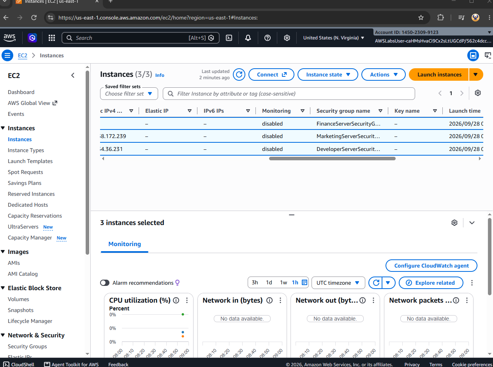
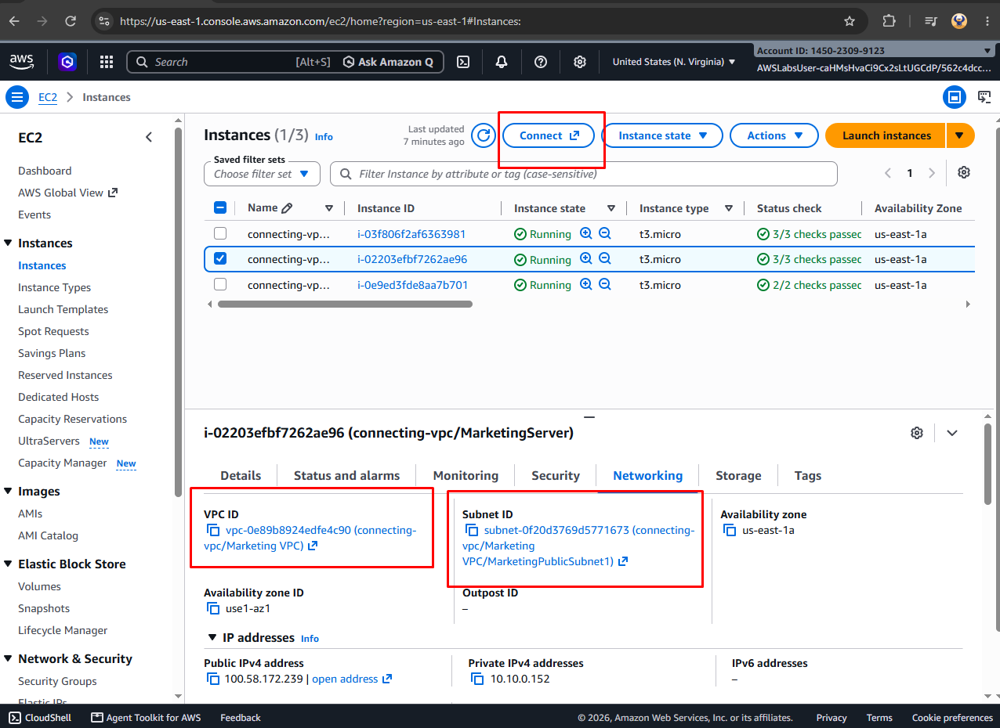
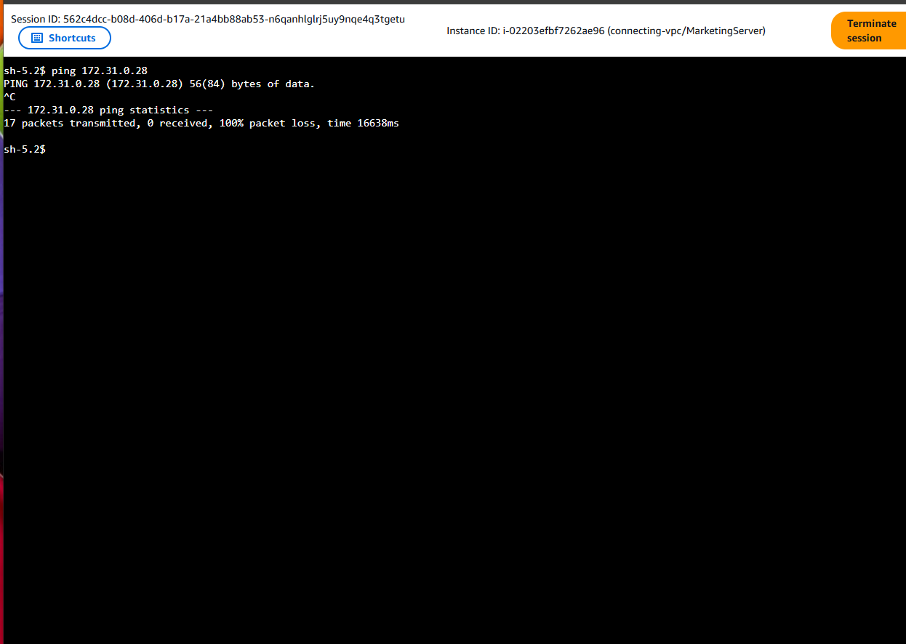
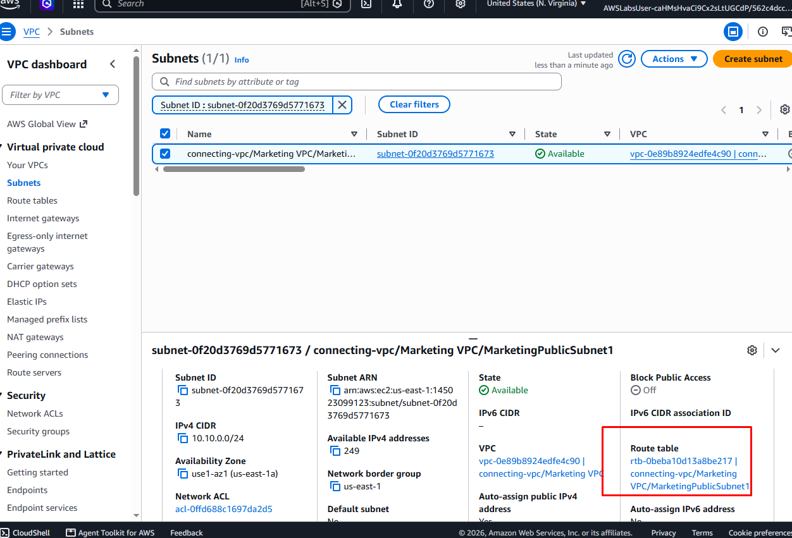
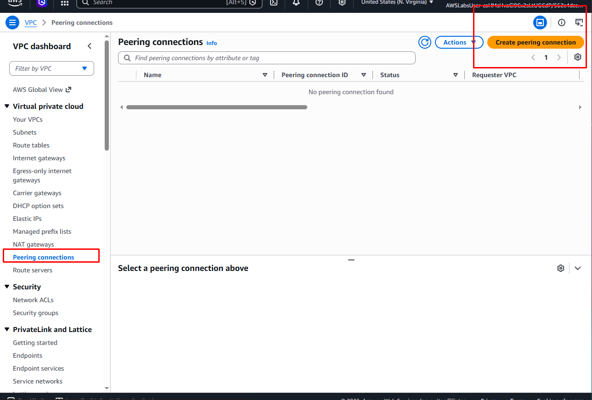
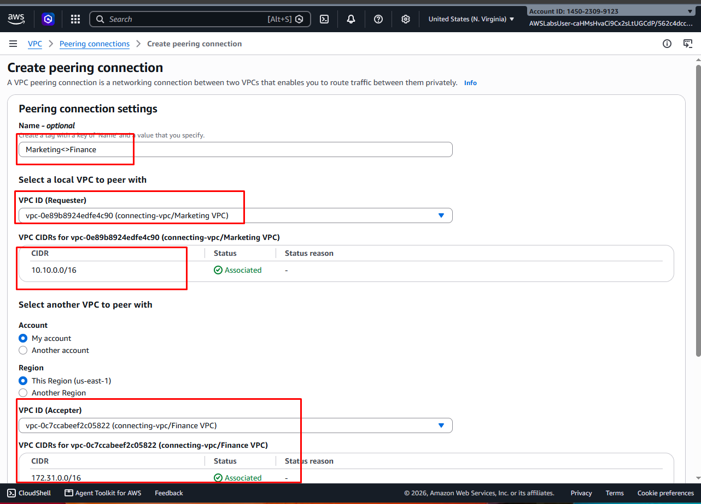
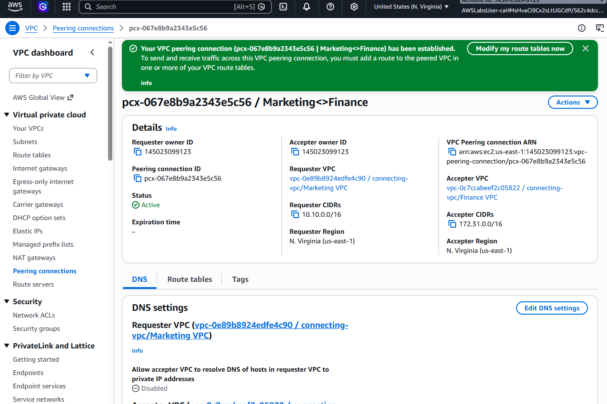
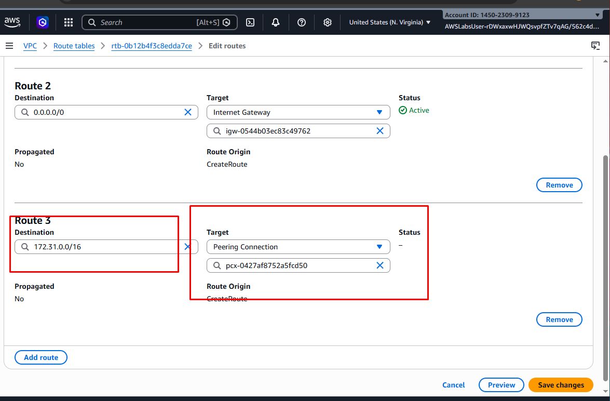
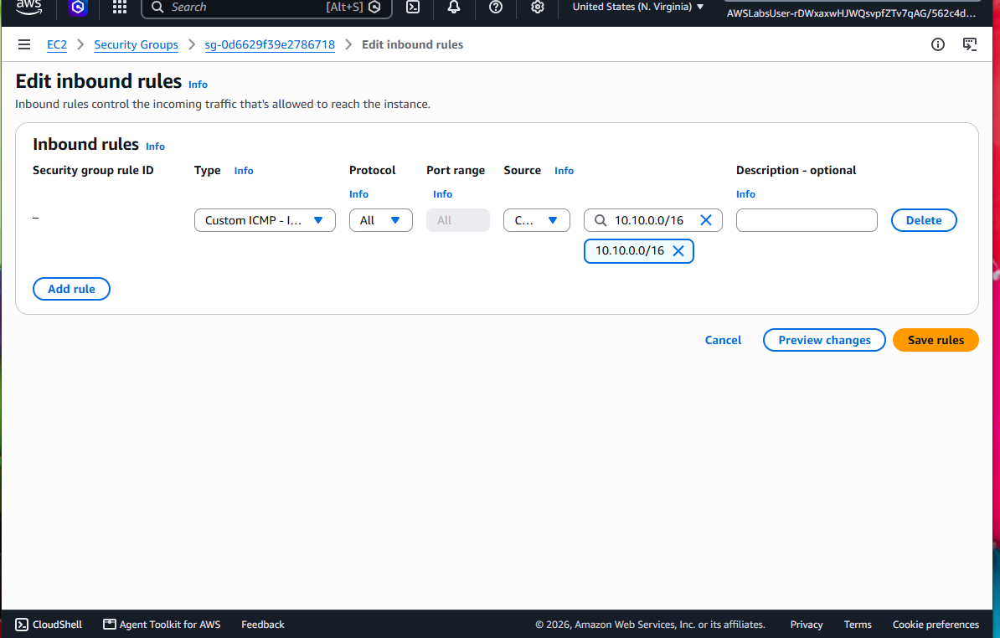
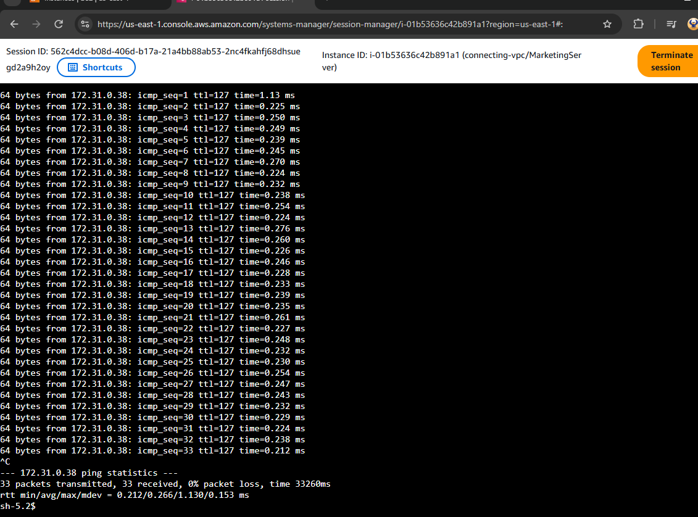

Project 6 — AWS VPC Peering: Multi-VPC Connectivity & Route Management

📋 Project Overview

This project demonstrates the configuration of VPC peering connections to establish private network connectivity between multiple AWS VPCs or a mesh architecture.

The implementation covers VPC identification, connectivity testing, route table configuration, peering connection creation, and security group rules to enable controlled communication between the Marketing, Finance and Developer VPCs.

---

🔧 Implementation

1. Identifying VPCs for Connectivity

Identified the multiple departmental VPCs that required private network connectivity as part of the multi-VPC architecture. 

---

2. Reviewing Marketing VPC Configuration

Reviewed the Marketing VPC configuration and network details to establish the existing environment before creating the peering connection.

---

3. Testing Initial Connectivity

Attempted to ping the Finance environment from the Marketing VPC to verify whether network connectivity existed before configuring the required VPC peering and routing components.

---

4. Accessing the Marketing Route Table

Accessed the Marketing VPC route table to review the existing traffic-routing configuration and prepare it for the new VPC peering connection.

---

5. Configuring VPC Peering

Initiated the process of establishing a VPC peering connection between the departmental VPCs to enable private communication between their networks.

---

6. Defining the Requester & Accepter VPCs

Configured the peering connection by specifying the requester VPC and accepter VPC, establishing the intended network relationship between the Marketing and Finance environments.

---

7. VPC Peering Connection Established

Completed the peering configuration and verified that the VPC peering connection was successfully established between the two VPCs.

---

8. Updating Route Tables

Added the VPC peering connection to the Marketing route table and configured the corresponding route for the Finance VPC, allowing traffic destined for the remote VPC to use the established peering connection.

---

9. Updating Finance Security Group

Added an inbound security group rule to the Finance environment to permit the required ICMP traffic from the Marketing network, enabling connectivity testing between the two VPCs.

---

10. Verifying Marketing-to-Finance Connectivity

Tested the completed network configuration to verify communication between the Marketing and Finance VPCs after implementing the peering connection, routing, and security controls.

---

🏁 Project Summary & Technical Takeaways

This project demonstrates the implementation of AWS VPC peering for private connectivity between separate VPC environments. The configuration required coordination between VPC peering, route tables, and security group rules to establish and control traffic between the Marketing and Finance networks.

The project also demonstrates the importance of validating connectivity at multiple layers—peering status, routing configuration, and network security controls**—when troubleshooting inter-VPC communication.

🛠️ Core Competencies Demonstrated

* VPC Peering: Established private connectivity between separate AWS VPCs.
* Multi-VPC Networking: Configured communication between departmental network environments.
* Route Management: Added peering routes to direct traffic between VPCs.
* Network Security: Applied security group rules to control permitted traffic.
* Connectivity Testing: Used network testing to validate communication between VPC environments.
* Network Troubleshooting: Identified and addressed connectivity requirements across peering, routing, and security layers.
* Cloud Network Architecture: Demonstrated practical implementation of interconnected VPC environments.

