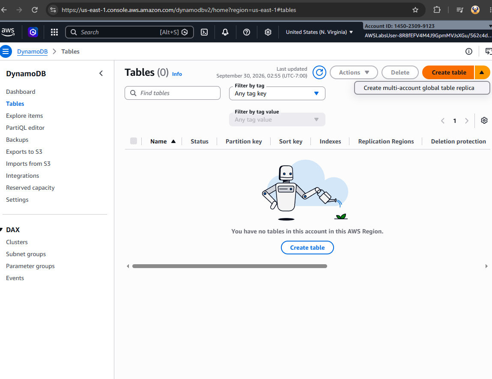
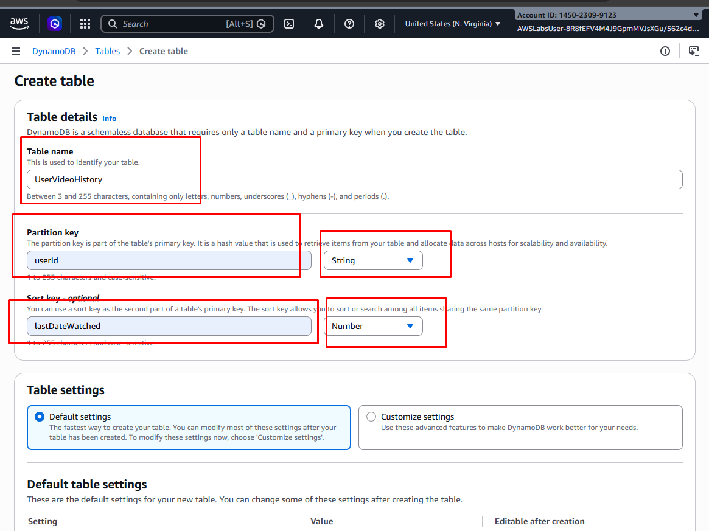
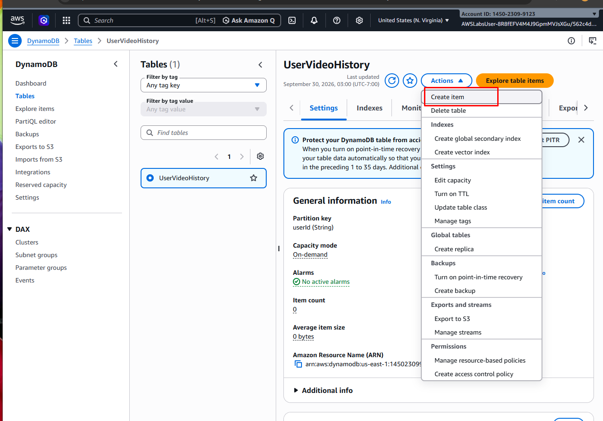
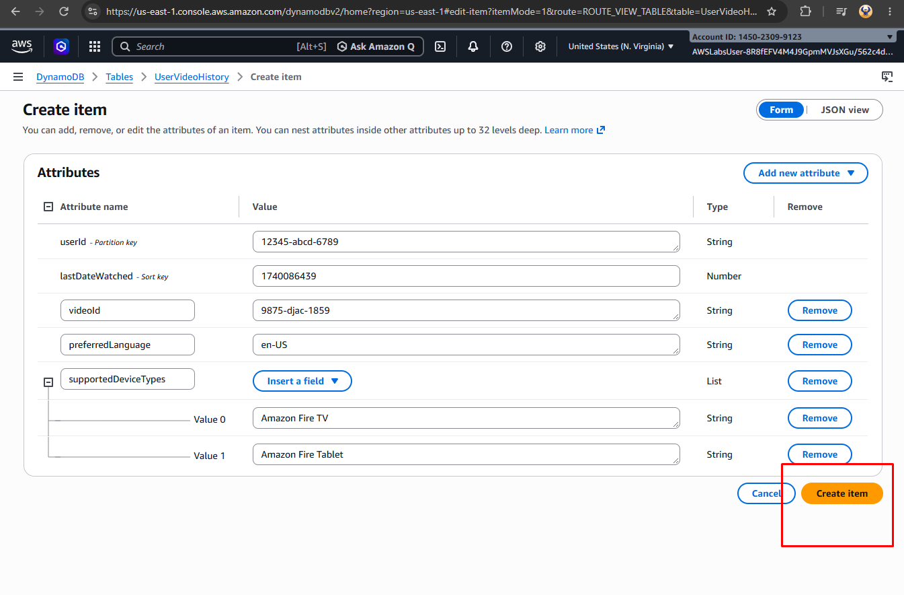
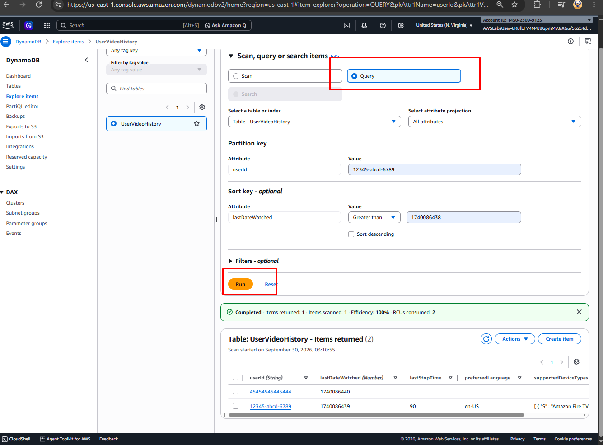
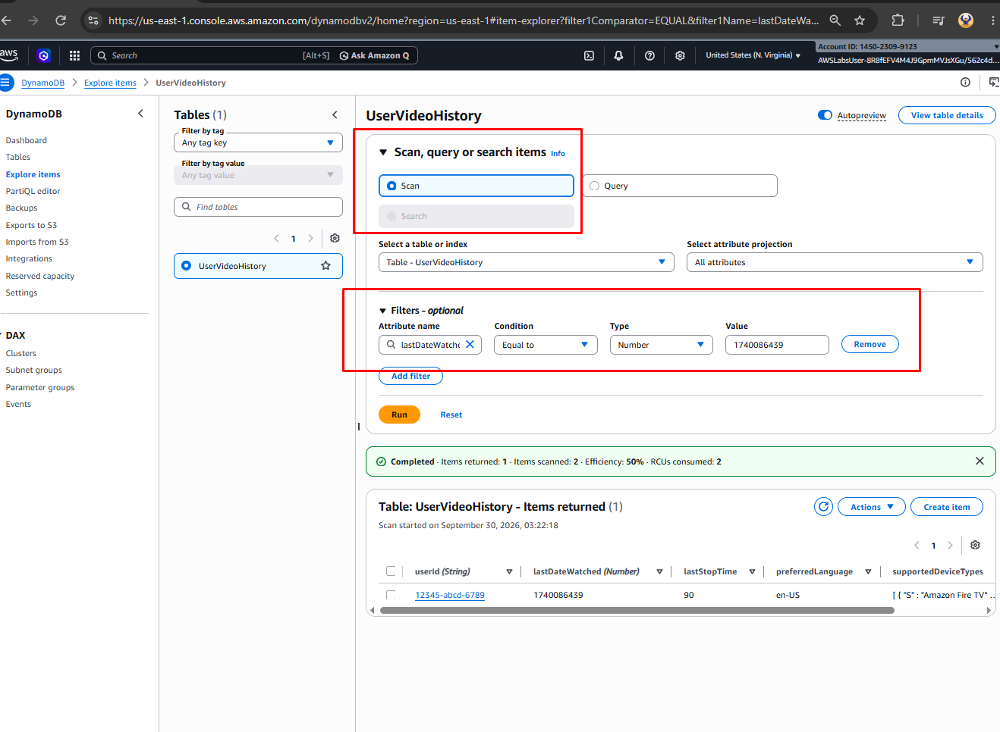

Project 7 — Amazon DynamoDB: NoSQL Data Modeling & Query Operations

📋 Project Overview

This project demonstrates the creation and management of a serverless NoSQL database using Amazon DynamoDB. The implementation covers table creation, primary key design, item management, attribute creation, and data retrieval using sort and Scan operations.

🔧 Implementation

1. Creating a DynamoDB Table

Created a new Amazon DynamoDB table to establish the NoSQL database environment.

---

2. Configuring the DynamoDB Table

Configured the table's key structure by defining the partition key and sort key.

The partition key determines how DynamoDB distributes items across partitions, while the sort key organizes related items within the same partition key.

---

3. Adding Items to the Table

After successfully creating the table, added data items to populate the DynamoDB database.

---

4. Adding Additional Attributes

Added additional attributes to the DynamoDB items to store supplementary data associated with each record.

DynamoDB uses a flexible schema, allowing items to contain additional attributes without requiring a fixed relational table structure.

---

5. Sorting DynamoDB Data

Used the **Sort** functionality to organize and examine the stored items based on the available table attributes and key structure.

---

6. Scanning the DynamoDB Table

Performed a **Scan** operation to retrieve and examine items stored within the DynamoDB table.

A Scan evaluates items across the table rather than targeting a specific partition key, making it useful for reviewing the table's stored data.

---

🏁 Project Summary & Technical Takeaways

This project demonstrates the implementation of a **serverless NoSQL database using Amazon DynamoDB**, including table creation, key design, item management, flexible attributes, and data retrieval operations.

The implementation demonstrates practical understanding of DynamoDB's **key-value and document data model**, including how partition keys, sort keys, and table operations support scalable NoSQL data management.

🛠️ Core Competencies Demonstrated

* **NoSQL Database Design:** Created and configured a DynamoDB table using a key-based data model.
* **Data Modeling:** Defined partition and sort keys to structure and organize database items.
* **Item Management:** Added records and additional attributes using DynamoDB's flexible schema.
* **Data Retrieval:** Used DynamoDB sorting and scanning operations to examine stored data.
* **Serverless Database Architecture:** Utilized a fully managed AWS database service without managing database servers.
* **AWS Database Services:** Demonstrated practical implementation of Amazon DynamoDB for NoSQL workloads.

