# Project 8 — Amazon EFS: Shared File Storage Across Multi-AZ EC2 Instances

## 📋 Project Overview

This project demonstrates the implementation of **Amazon Elastic File System (EFS)** as shared storage for multiple EC2 instances deployed across different Availability Zones.

The implementation covers EFS creation and configuration, security group access, mounting the file system to Linux EC2 instances, and validating that files created on one web server can be accessed by other servers connected to the same EFS file system.

---

# 🔧 Implementation

## 1. Identifying EC2 Instances Across Availability Zones

Reviewed the EC2 environment containing multiple web server instances deployed across different **Availability Zones**. All three servers were associated with the **Web Server security group** and required access to a common EFS file system.

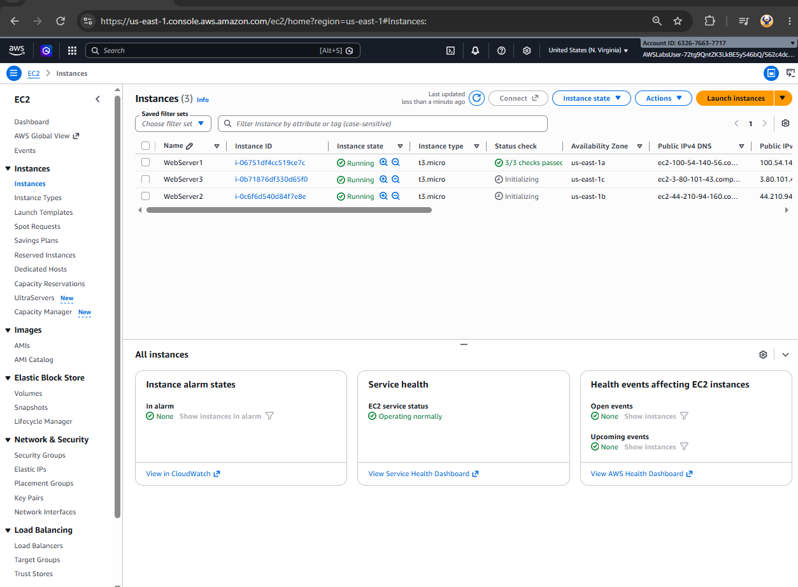

---

## 2. Configuring Security Group Access to EFS

Created and configured the required security group access to allow the web server instances to connect to the EFS file system through its mount targets.

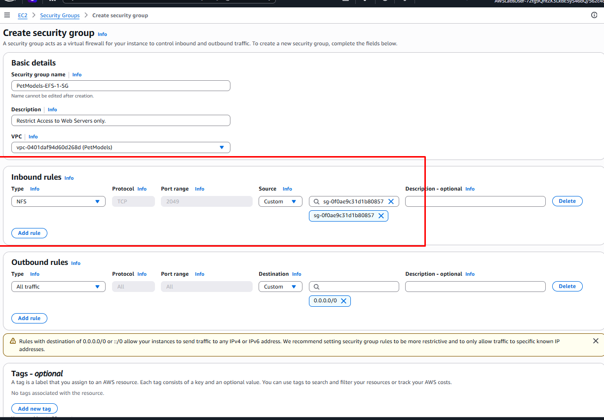

---

## 3. Creating the EFS File System

Created an **Amazon Elastic File System (EFS)** to provide shared file storage that could be accessed by the web server instances.

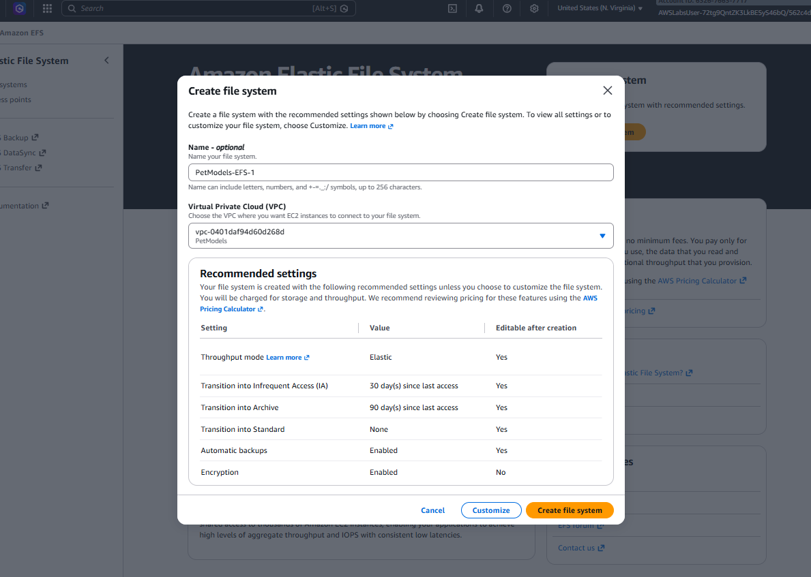

---

## 4. EFS File System Configuration

Configured the EFS file system and verified its assigned **File System ID**:

The EFS file system was configured to support access from the required EC2 environments.

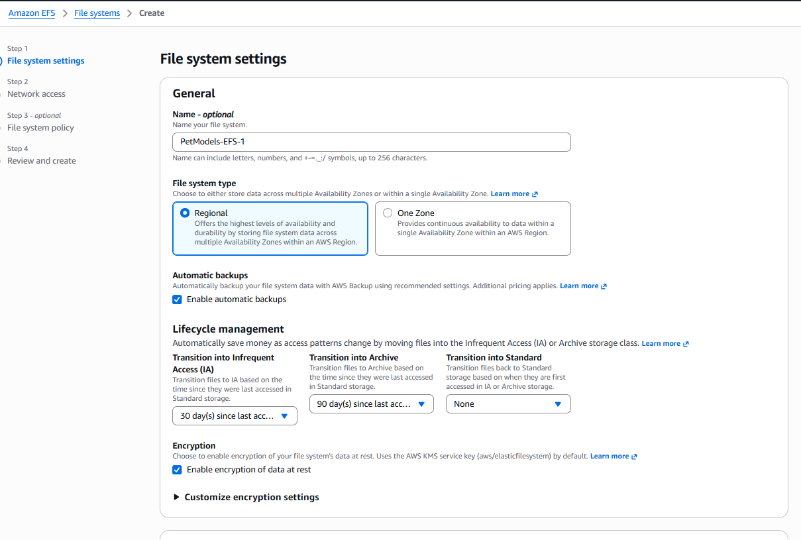

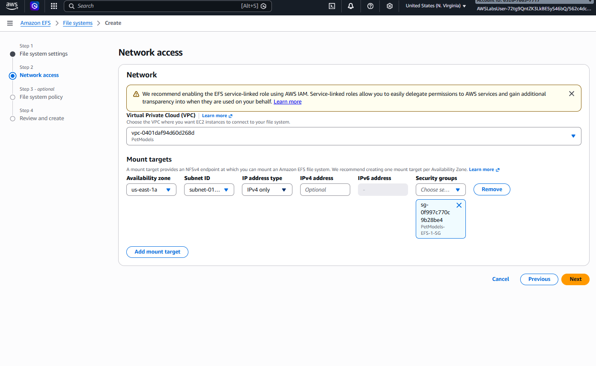

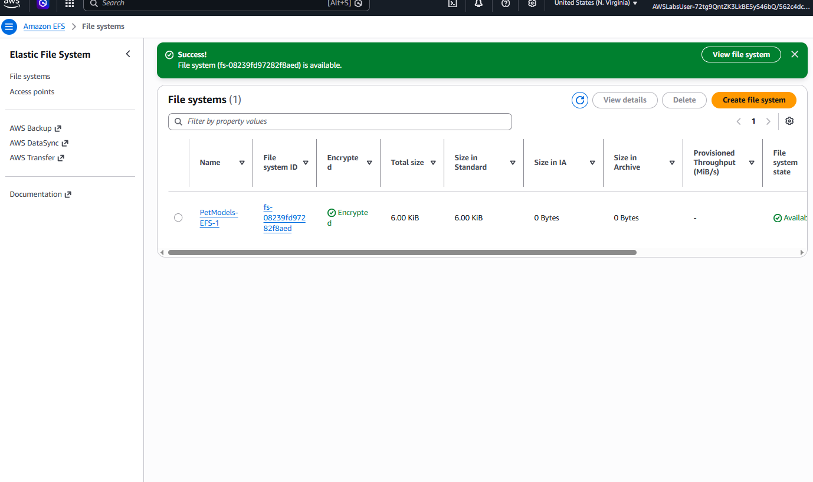

---

## 5. Preparing the EC2 Instance for EFS

Accessed the Linux EC2 instance and prepared the environment for mounting the EFS file system.

Created a local `data` directory to serve as the mount point for the shared file system.

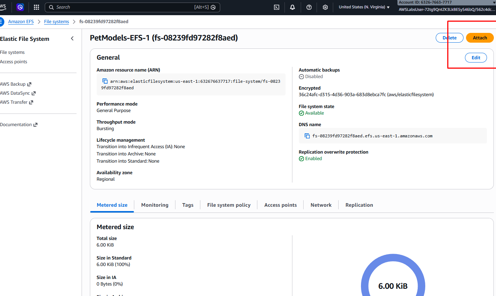

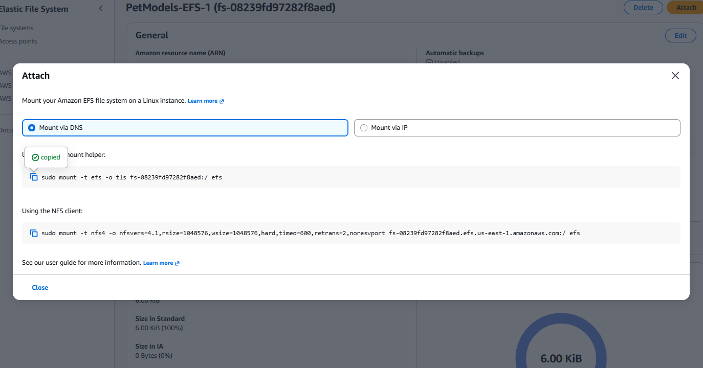

---

## 6. Installing Amazon EFS Utilities

Installed the **Amazon EFS utilities package** on the Linux EC2 instance to provide the required tools for mounting and working with Amazon EFS.
all -y amazon-efs-utils

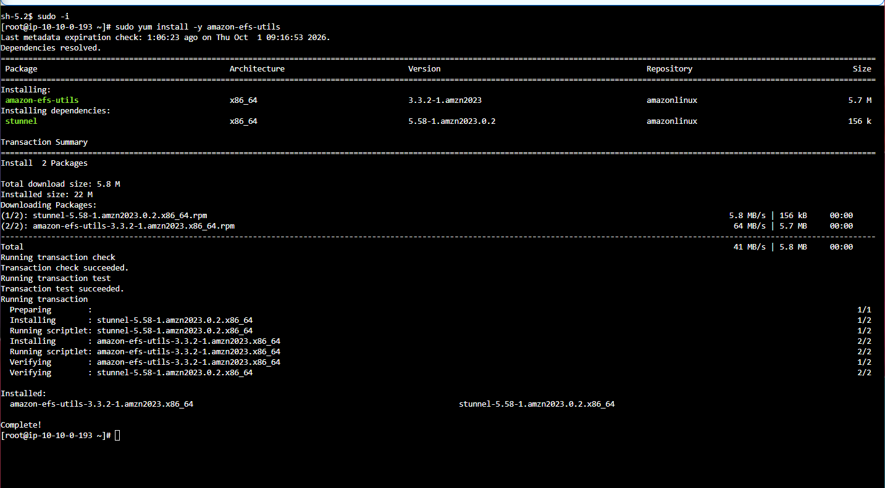

---

## 7. Mounting the EFS File System

Mounted the EFS file system to the local `data` directory using the EFS mount helper 

After mounting, the `data` directory provided access to the shared EFS storage from the EC2 instance.

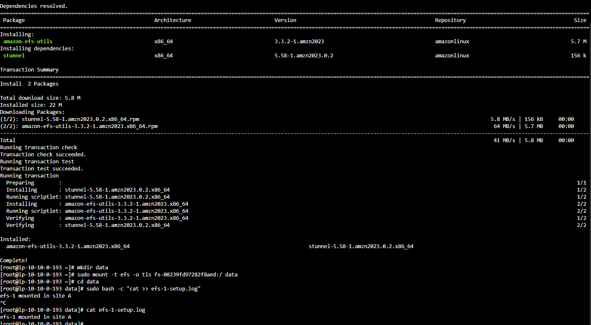

---

## 8. Creating & Verifying a Shared File

Created an example log file within the mounted EFS directory to verify that data could be written to the shared file system.

The example file recorded that **EFS-1 was mounted on Site A**.

This demonstrated that the EC2 instance could successfully write to and read from the mounted EFS file system.
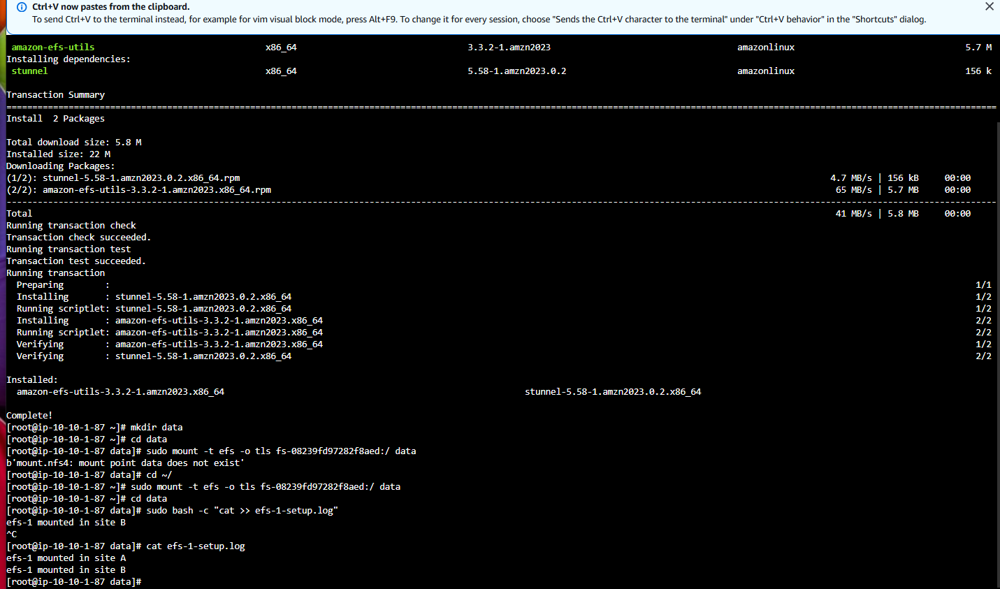

---

## 9. Configuring Web Server 2 & Verifying Shared Storage

Configured the second web server to connect to the same EFS file system and verified that the previously created log file was accessible from the second instance.

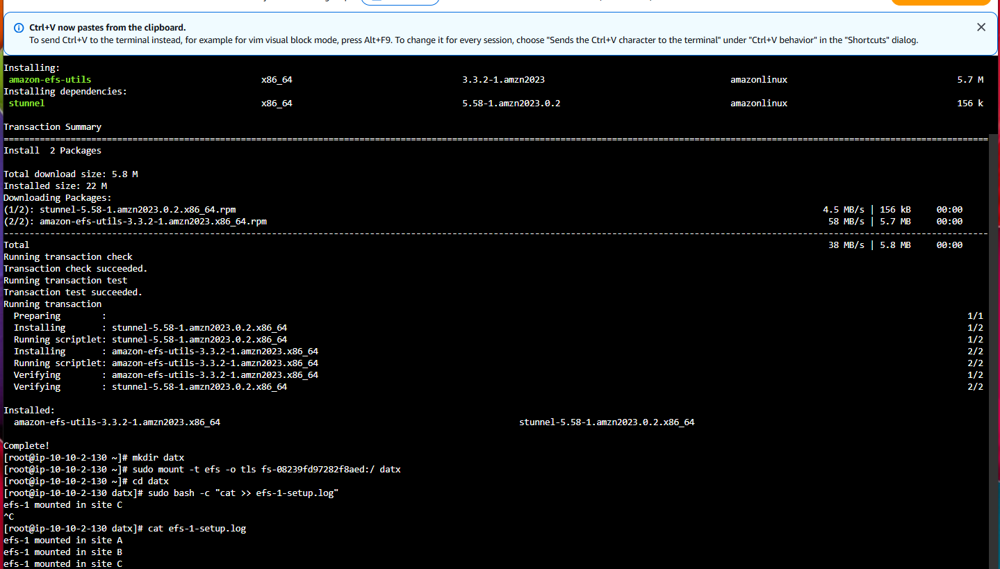

The same file could be accessed from multiple EC2 instances because they were connected to the **same EFS file system**, demonstrating shared storage across the web server environment.

---

# 🏁 Project Summary & Technical Takeaways

This project demonstrates the implementation of **Amazon EFS as shared, managed file storage for multiple EC2 instances across Availability Zones**.

The implementation covered EFS creation, network and security configuration, Linux EFS utilities, encrypted mounting, file creation, and validation of shared file access between web servers.

## 🛠️ Core Competencies Demonstrated

* **Shared Cloud Storage:** Implemented Amazon EFS as shared file storage for multiple EC2 instances.
* **Multi-AZ Architecture:** Connected EC2 instances across different Availability Zones to a common file system.
* **Network Security:** Configured security group access between the web servers and EFS.
* **Linux Administration:** Installed EFS utilities, created mount points, and mounted the file system from a Linux EC2 instance.
* **Encrypted Data Transfer:** Used the EFS mount helper with TLS for data in transit.
* **Shared File Management:** Created, accessed, and verified files through multiple EC2 instances using the same EFS storage.
* **Scalable Storage Architecture:** Demonstrated how managed shared storage can support multiple web servers without maintaining separate local copies of files.

